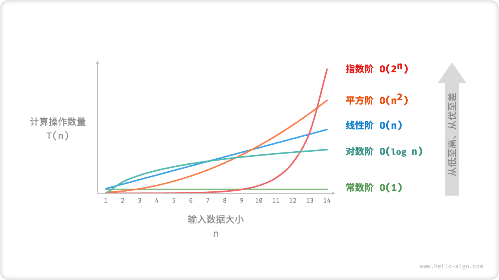

# 算法

## 一、算法概述

算法是一组明确的规则或步骤，用于解决某种问题或执行某种任务的过程。在计算机科学中，算法通常用来处理数据、执行计算和自动推理。每个算法都有明确定义的输入和输出，以及清晰描述其操作的步骤。

### 1. 算法无处不在

当我们听到“算法”这个词时，很自然地会想到数学。然而实际上，许多算法并不涉及复杂数学，而是更多地依赖于基本逻辑，这些逻辑在我们的日常生活中处处可见。

在正式探讨算法之前，有一个有趣的事实值得分享：**实际上，你已经学会了许多算法，并习惯将他们应用到日常生活中了**。下面，我将举两个具体例子来证实这一点。

**例一：组装积木**。一套积木，除了包含许多零件之外，还附有详细的组装说明书。我们按照说明书一步步操作，就能组装出精美的积木模型。

从数据结构与算法的角度来看，积木的各种形状和连接方式代表数据结构，而组装说明书上的一系列步骤则是算法。

**例二：查阅字典**。在字典里，每个汉字都对应一个拼音，而字典是按照拼音的英文字母顺序排列的。假设我们需要查找一个拼音首字母为`𝚛`的字，通常会这样操作：

1. 翻开字典约一半的页数，查看该页首字母是什么（假设为`𝚖`）；
2. 由于在英文字母表中`𝚛` 位于`𝚖`之后，所以排除字典前半部分，查找范围缩小到后半部分；
3. 不断重复步骤 1-2 ，直至找到拼音首字母为`𝚛`的页码为止。

<!-- tabs:start -->

#### **Step 1**


#### **Step 2**


#### **Step 3**


#### **Step 4**


#### **Step 5**


<!-- tabs:end -->

查阅字典这个小学生必备技能，实际上就是著名的「二分查找」。从数据结构的角度，我们可以把字典视为一个已排序的「数组」；从算法的角度，我们可以将上述查字典的一系列操作看作是「二分查找」算法。

小到烹饪一道菜，大到星际航行，几乎所有问题的解决都离不开算法。计算机的出现使我们能够通过编程将数据结构存储在内存中，同时编写代码调用 CPU 和 GPU 执行算法。这样一来，我们就能把生活中的问题转移到计算机上，以更高效的方式解决各种复杂问题。

### 2. 算法的主要特性

1. 输入：一个算法应有零个或多个自定义的输入。
2. 输出：一个算法应有至少一个或多个自定义的输出，并且应与输入有所对应。
3. 明确性：算法的描述必须无歧义，以保证其实现的一致性。
4. 可行性：算法应当是可以实现的，不仅在理论上是可行的，实际上也应能通过有限的资源在有限时间内完成。
5. 有限性：如果算法在执行后能在有限的时间内停止，那么我们说该算法是有限的。

在计算机科学中，设计有效的算法是非常重要的。它决定了程序的运行速度和资源利用效率，直接影响到软件或系统的性能。算法的设计和分析是计算机科学中的一个重要领域，其中涵盖了许多不同类型的问题和解决方案，例如排序和查找算法、图算法、动态规划等。

## 二、算法效率衡量

### 1. 引入

先来看一道题:

**如果 `a+b+c=1000`，且 `a²+b²=c²`（a,b,c 为自然数），如何求出所有a、b、c可能的组合?**

#### 第一次尝试

```python
import time

start_time = time.time()

# 注意是三重循环
for a in range(0, 1001):
    for b in range(0, 1001):
        for c in range(0, 1001):
            if a**2 + b**2 == c**2 and a+b+c == 1000:
                print("a, b, c: %d, %d, %d" % (a, b, c))

end_time = time.time()
print("elapsed: %f" % (end_time - start_time))
print("complete!")
```

运行结果：

```python
a, b, c: 0, 500, 500
a, b, c: 200, 375, 425
a, b, c: 375, 200, 425
a, b, c: 500, 0, 500
elapsed: 214.583347
complete!
```

**注意运行的时间:214.583347秒**

#### 第二次尝试

```python
import time

start_time = time.time()

# 注意是两重循环
for a in range(0, 1001):
    for b in range(0, 1001-a):
        c = 1000 - a - b
        if a**2 + b**2 == c**2:
            print("a, b, c: %d, %d, %d" % (a, b, c))

end_time = time.time()
print("elapsed: %f" % (end_time - start_time))
print("complete!")
```

运行结果：

```python
a, b, c: 0, 500, 500
a, b, c: 200, 375, 425
a, b, c: 375, 200, 425
a, b, c: 500, 0, 500
elapsed: 0.182897
complete!
```

**注意运行的时间:0.182897秒**

### 2. 执行时间反应算法效率

对于同一问题，我们给出了两种解决算法，在两种算法的实现中，我们对程序执行的时间进行了测算，发现两段程序执行的时间相差悬殊（214.583347秒相比于0.182897秒），由此我们可以得出结论：**实现算法程序的执行时间可以反应出算法的效率，即算法的优劣。**

但是，单靠时间值绝对可信吗？

假设我们将第二次尝试的算法程序运行在一台配置古老性能低下的计算机中，情况会如何？很可能运行的时间并不会比在我们的电脑中运行算法一的214.583347秒快多少。

**单纯依靠运行的时间来比较算法的优劣并不一定是客观准确的！**

程序的运行离不开计算机环境（包括硬件和操作系统），这些客观原因会影响程序运行的速度并反应在程序的执行时间上。那么如何才能客观的评判一个算法的优劣呢？

### 3.  算法评价维度

从总体上看，算法设计追求以下两个层面的目标：

1. **找到问题解法**。算法需要在规定的输入范围内，可靠地求得问题的正确解。
2. **寻求最优解法**。同一个问题可能存在多种解法，我们希望找到尽可能高效的算法。

因此，在能够解决问题的前提下，算法效率成为主要的评价维度，主要包括：

- **时间效率**，即算法运行速度的快慢。
- **空间效率**，即算法占用内存空间的大小。

简而言之，**我们的目标是设计“既快又省”的数据结构与算法**。掌握评估算法效率的方法则至关重要，因为只有了解评价标准，我们才能进行算法之间的对比分析，从而指导算法设计与优化过程。

### 4. 效率评估方法

#### 实际测试

假设我们现在有算法 A 和算法 B，它们都能解决同一问题，现在需要对比这两个算法的效率。我们最直接的方法就是找一台计算机，运行这两个算法，并监控记录它们的运行时间和内存占用情况。这种评估方式能够反映真实情况，但也存在较大局限性。

**难以排除测试环境的干扰因素**。硬件配置会影响算法的性能表现。例如，在某台计算机中，算法 A 的运行时间比算法 B 短；但在另一台配置不同的计算机中，我们可能得到相反的测试结果。这意味着我们需要在各种机器上进行测试，而这是不现实的。

**展开完整测试非常耗费资源**。随着输入数据量的变化，算法会表现出不同的效率。例如，输入数据量较小时，算法 A 的运行时间可能短于算法 B；而输入数据量较大时，测试结果可能相反。因此，为了得到有说服力的结论，我们需要测试各种规模的输入数据，这样需要占用大量的计算资源。

#### 理论估算

由于实际测试具有较大的局限性，我们可以考虑仅通过一些计算来评估算法的效率。这种估算方法被称为「复杂度分析 Complexity Analysis」或「渐近复杂度分析 Asymptotic Complexity Analysis」。

**复杂度分析评估的是算法运行效率随着输入数据量增多时的增长趋势**。这个定义有些拗口，我们可以将其分为三个重点来理解：

- “算法运行效率”可分为“运行时间”和“占用空间”，因此我们可以将复杂度分为「时间复杂度 Time Complexity」和「空间复杂度 Space Complexity」；
- “随着输入数据量增多时”表示复杂度与输入数据量有关，反映了算法运行效率与输入数据量之间的关系；
- “增长趋势”表示复杂度分析关注的是算法时间与空间的增长趋势，而非具体的运行时间或占用空间；

**复杂度分析克服了实际测试方法的弊端**。首先，它独立于测试环境，因此分析结果适用于所有运行平台。其次，它可以体现不同数据量下的算法效率，尤其是在大数据量下的算法性能。

## 三、时间复杂度与“大O记法”

我们假定计算机执行算法每一个基本操作的时间是固定的一个时间单位，那么有多少个基本操作就代表会花费多少时间单位。算法对于不同的机器环境而言，确切的单位时间是不同的，但是对于算法进行多少个基本操作（即花费多少时间单位）在规模数量级上却是相同的，由此可以忽略机器环境的影响而客观的反应算法的时间效率。

对于算法的时间效率，我们可以用“大O记法”来表示。

### 1. 大O记法

对于单调的整数函数`f`，如果存在一个整数函数`g`和实常数`c>0`，使得对于充分大的`n`总有`f(n)<=c*g(n)`，就说函数`g`是`f`的一个渐近函数（忽略常数），记为`f(n)=O(g(n))`。也就是说，在趋向无穷的极限意义下，函数f的增长速度受到函数`g`的约束，亦即函数`f`与函数`g`的特征相似。

### 2. 时间复杂度

假设存在函数`g`，使得算法`A`处理规模为`n`的问题示例所用时间为`T(n)=O(g(n))`，则称`O(g(n))`为算法`A`的渐近时间复杂度，简称时间复杂度，记为`T(n)`

### 3. 如何理解“大O记法”

对于算法进行特别具体的细致分析虽然很好，但在实践中的实际价值有限。对于算法的时间性质和空间性质，最重要的是其数量级和趋势，这些是分析算法效率的主要部分。而计量算法基本操作数量的规模函数中那些常量因子可以忽略不计。例如，可以认为`3n²`和`100n²`属于同一个量级，如果两个算法处理同样规模实例的代价分别为这两个函数，就认为它们的效率“差不多”，都为`n²`级。

### 4. 最坏时间复杂度

分析算法时，存在几种可能的考虑：

- 算法完成工作最少需要多少基本操作，即**最优时间复杂度**
- 算法完成工作最多需要多少基本操作，即**最坏时间复杂度**
- 算法完成工作平均需要多少基本操作，即**平均时间复杂度**

对于最优时间复杂度，其价值不大，因为它没有提供什么有用信息，其反映的只是最乐观最理想的情况，没有参考价值。

对于最坏时间复杂度，提供了一种保证，表明算法在此种程度的基本操作中一定能完成工作。

对于平均时间复杂度，是对算法的一个全面评价，因此它完整全面的反映了这个算法的性质。但另一方面，这种衡量并没有保证，不是每个计算都能在这个基本操作内完成。而且，对于平均情况的计算，也会因为应用算法的实例分布可能并不均匀而难以计算。

**因此，我们主要关注算法的最坏情况，亦即最坏时间复杂度。**

### 5. 时间复杂度的几条基本计算规则

1. 基本操作，即只有常数项，认为其时间复杂度为`O(1)`
2. 顺序结构，时间复杂度按**加法**进行计算
3. 循环结构，时间复杂度按**乘法**进行计算
4. 分支结构，时间复杂度**取最大值**
5. 判断一个算法的效率时，往往只需要关注操作数量的最高次项，其它次要项和常数项可以忽略
6. 在没有特殊说明时，我们所分析的算法的时间复杂度都是指**最坏时间复杂度**

### 6. 算法分析

第一次尝试的算法核心部分

```python
for a in range(0, 1001):
    for b in range(0, 1001):
        for c in range(0, 1001):
            if a**2 + b**2 == c**2 and a+b+c == 1000:
                print("a, b, c: %d, %d, %d" % (a, b, c))
```

**时间复杂度：**

T(`n`) = O(`n*n*n`) = O(`n³`)

第二次尝试的算法核心部分

```python
for a in range(0, 1001):
    for b in range(0, 1001-a):
        c = 1000 - a - b
        if a**2 + b**2 == c**2:
            print("a, b, c: %d, %d, %d" % (a, b, c))
```

**时间复杂度：**

T(`n`) = O(`n*n*(1+1)`) = O(`n*n`) = O(`n²`)

**由此可见，我们尝试的第二种算法要比第一种算法的时间复杂度好多的。**

### 7. 常见时间复杂度

| 执行次数函数举例 |     阶     | 解释                                                         |
| ---------------- | :--------: | :----------------------------------------------------------- |
| 12               |   `O(1)`   | 不论输入数据的规模如何，执行时间都是恒定的。例如，访问数组中的元素。 |
| 2n+3             |   `O(n)`   | 执行时间与输入数据规模成正比。例如，遍历数组中的每一个元素。 |
| 3n²+2n+1         |  `O(n²)`   | 执行时间与输入数据规模的平方成正比。例如，冒泡排序、插入排序等。 |
| 5log₂n+20        | `O(logn)`  | 当输入数据规模增大时，执行时间会增长，但增长的速度会随着数据规模的增大而减慢。例如，二分搜索算法。 |
| 2n+3nlog₂n+19    | `O(nlogn)` | 这是一种介于线性和二次之间的时间复杂度，常见的有快速排序、归并排序等。 |
| 6n³+2n²+3n+4     |  `O(n³)`   | 执行时间与输入数据规模的立方成正比。这种时间复杂度的算法通常在数据规模较小的情况下使用，例如Floyd算法或者简单的三层嵌套循环。 |
| 2ⁿ               |  `O(2ⁿ)`   | 执行时间与输入数据规模的指数。例如，解决旅行商问题的穷举搜索。 |

**注意，经常将log2n（以2为底的对数）简写成logn**

以下是它们之间的关系（从最快到最慢）：

$$
\begin{aligned}
O(1) < O(\log n) < O(n) < O(n \log n) < O(n^2) < O(2^n) < O(n!) \newline
\text{常数阶} < \text{对数阶} < \text{线性阶} < \text{线性对数阶} < \text{平方阶} < \text{指数阶} < \text{阶乘阶}
\end{aligned}
$$


选择合适的算法和数据结构，可以使我们在解决问题时更有效地使用计算资源。注意，一个具有较低时间复杂度的算法不一定总是在实际使用中更快。例如，对于小规模的输入，一个`O(n²) `的算法可能比一个 `O(n log n)`的算法更快。这是因为时间复杂度通常不考虑常数因子和较小的项。

## 四、空间复杂度分析

空间复杂度是对一个算法在运行过程中临时占用存储空间大小的度量。它也是衡量算法优劣的重要因素之一。

空间复杂度的计算通常包含以下几个部分：

1. 固定空间需求：这部分包括算法所需的固定空间，如常量、简单变量、函数参数等。不论程序运行时的不同情况，这部分空间的大小都是固定的。
2. 变量空间需求：这部分空间的大小与特定的情况有关，如大小为 n 的数组，递归栈等。这部分空间的大小在程序运行过程中是不断变化的。
3. 输出空间需求：如果问题规模 n 较大，输出所占用的空间也不能忽视。例如，深度或广度优先遍历图或树的情况，可能需要返回所有的遍历结果，这就涉及到输出空间的需求。

空间复杂度通常以大`O`符号表示，常见的空间复杂度有：`O(1)`、`O(n)`、`O(n²)`，等等。例如，常数空间复杂度是 `O(1)`，线性空间复杂度是 `O(n)`，二维数组的空间复杂度是 `O(n²)`，递归算法的空间复杂度等于递归深度，等等。

